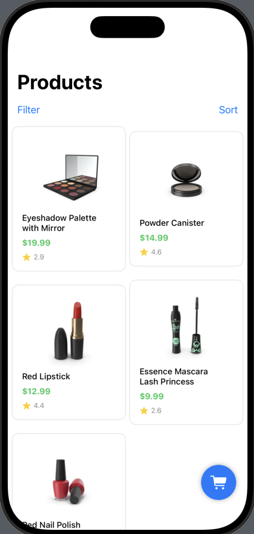
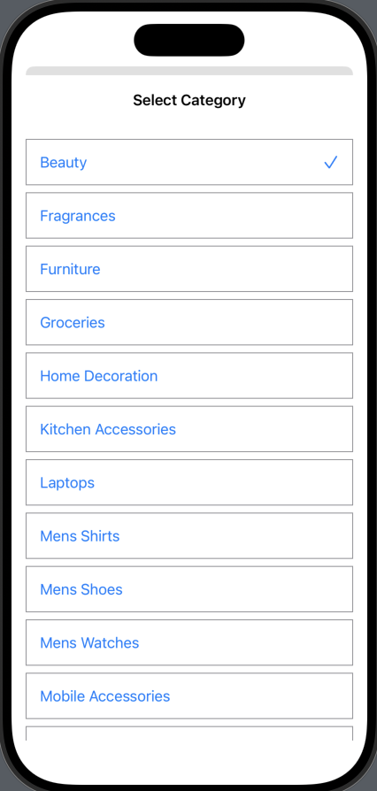
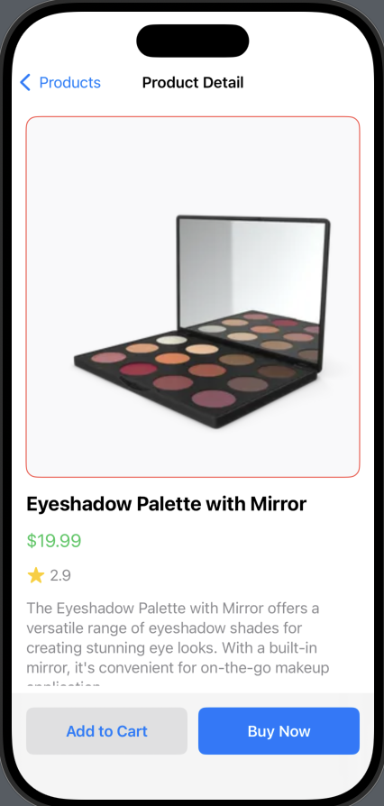
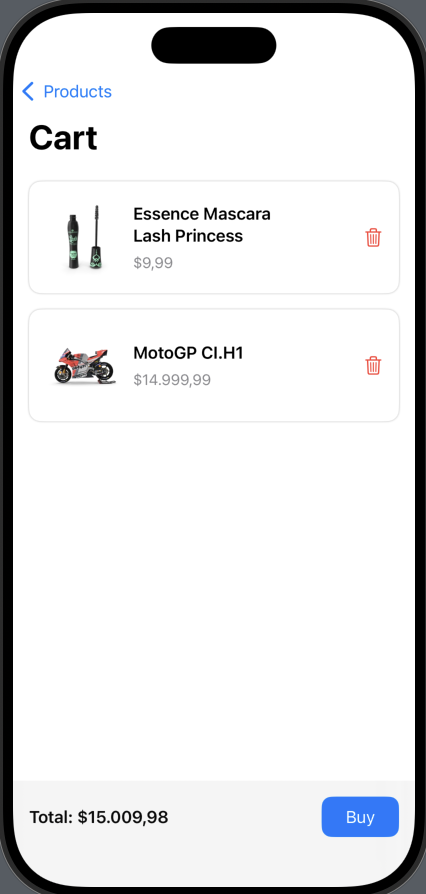

# Cloud Shopping Store

Cloud Shopping Store is a mock e-commerce app built with SwiftUI. This project is designed as a learning resource for exploring SwiftUI concepts, state management, navigation, and basic networking in iOS/macOS development.

## Features

- **Product Listing:** Browse products fetched from a remote API, displayed in a responsive grid.
- **Product Details:** View detailed information about each product, including images, price, rating, and description.
- **Cart Management:** Add products to a cart, view cart contents, and remove items.
- **Category Filtering:** Filter products by category using a modal sheet.
- **Sorting:** Sort products by title, price, or rating in ascending or descending order.
- **Networking:** Fetch products and categories from public APIs using `URLSession`.
- **State Management:** Uses `@StateObject`, `@EnvironmentObject`, and `@Published` for reactive UI updates.
- **SwiftUI Navigation:** Implements navigation between product list, detail, and cart views.
- **Modern UI:** Utilizes SwiftUI components like `LazyVGrid`, `ScrollView`, `Sheet`, and `AsyncImage`.

## Screenshots

  
  
  
  

## Project Structure

- `Models/` – Data models for products, categories, and sorting.
- `ViewModels/` – Observable objects for managing app state.
- `Views/` – Main SwiftUI views for product list, detail, and cart.
- `Components/` – Reusable UI components (cards, modals).
- `Services/` – API service for networking.
- `Utilities/` – (Reserved for helpers/utilities).
- `Assets.xcassets/` – App icons and colors.

## Learning Goals

- Practice building SwiftUI layouts and navigation.
- Understand state and data flow in SwiftUI apps.
- Learn how to fetch and decode JSON from APIs.
- Implement basic e-commerce features in a modular way.

## Dependencies

- [Alamofire](https://github.com/Alamofire/Alamofire) (included, but main networking uses `URLSession` for learning purposes).

## Credits

- [DummyJSON] (https://dummyjson.com/) (for free products API)
---

**Note:** This app is for educational purposes only and uses mock/public APIs. No real transactions or user data are handled.
